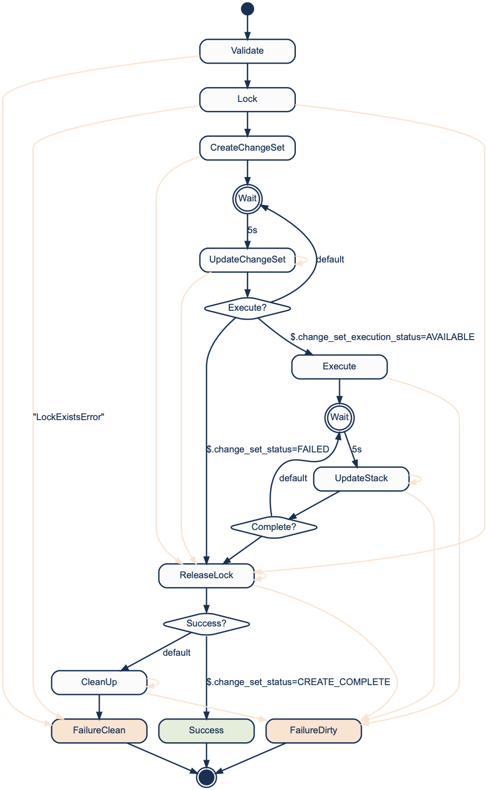

# Fenrir


Fenrir is a secure AWS SAM deployer with a CLI. If you are looking at scaling AWS SAM to being used in a large organization, or just want easier structured deploys for your own projects. Fenrir is a great and easy way to take the next step with serverless.

Fenrir:

1. Supports all languages by building lambda code inside a docker container
2. Validates the use of resources that are allowed to be used
3. Forces name conventions on created resources so that there is no overlap
4. Can be used to deploy across accounts

## Getting Started

Fenrir supports a subset of AWS SAM templates with only the addition of adding `ProjectName` and `ConfigName` to the top of the template.

So a simple `template.yml` would look like:

```
ProjectName: "coinbase/deploy-test"
ConfigName: "development"

AWSTemplateFormatVersion: "2010-09-09"
Transform: AWS::Serverless-2016-10-31

Resources:
  helloAPI:
    Type: AWS::Serverless::Api
    Properties:
      StageName: dev
      EndpointConfiguration: REGIONAL
  hello:
    Type: AWS::Serverless::Function
    Properties:
      CodeUri: .
      Role: lambda-role
      Handler: hello.lambda
      Runtime: go1.x
      Events:
        hi:
          Type: Api
          Properties:
            RestApiId: !Ref helloAPI
            Path: /hello
            Method: GET
```

With code that looks like:

```
package main

import (
	"github.com/aws/aws-lambda-go/lambda"
)

func main() {
	lambda.Start(func(_ interface{}) (interface{}, error) {
		return map[string]string{"body": "Hello"}, nil
	})
}
```

The name of the lambda function is `hello` so Fenrir expects the file `/hello.zip` to exist in the built docker conatiner by having a Dockerfile:

```
FROM golang
WORKDIR /
RUN apt-get update && apt-get upgrade -y && apt-get install -y zip

COPY . .
RUN go get github.com/aws/aws-lambda-go/lambda
RUN GOOS=linux GOARCH=amd64 go build -o hello.lambda .
RUN zip hello.zip hello.lambda
```

With these in place you can now execute:

* `go build -o hello.lambda . && sam local start-api` to start a local test API
* `fenrir package` to prepare the files needed to deploy
* `fenrir deploy` to deploy the template (*requires fenrir deployer*)

## Supported Resources

Fenrir does not support all SAM resources or all properties. Generally it limits all references resources (e.g. Security Groups, Subnets, S3, Kinesis) to have specific tags AND it forces good naming patterns to stop conflicts.

The specific resources that it supports, and their limitations are:

### AWS::Serverless::Function

1. `FunctionName` is generated and cannot be defined.
1. `Role` must have the tags `ProjectName`, `ConfigName` same as the template, and `ServiceName` equal to the name of the Lambda resource.
1. `VPCConfig.SecurityGroupIds` Each SG must have the `ProjectName`, `ConfigName` same as the template, and `ServiceName` equal to the name of the Lambda resource.
1. `VPCConfig.SubnetIds` must have the `DeployWithFenrir` tag equal to `true`.
1. `Events` supported `Type`s and their limitations are:
	1. `Api`: It must have `RestApiId` that is a reference to a local API resource
	1. `S3`: `Bucket` must have *correct tags*<sup>*</sup>
	1. `Kinesis`: `Stream` must have *correct tags*<sup>*</sup>
	1. `DynamoDB`: `Stream` must have *correct tags*<sup>*</sup>
	1. `SQS`: `Queue` must have *correct tags*<sup>*</sup>
	1. `Schedule`
	1. `CloudWatchEvent`

<sup>*</sup>: *correct tags* means tags are `FenrirAllAllowed=true` OR have `FenrirAllowed:<project>:<config>=true` OR `ProjectName` and `ConfigName` tags equal to the release.

### AWS::Serverless::Api

The limitations are:

1. `Name` is generated and cannot be defined
1. `EndpointConfiguration` defaults to `PRIVATE`

### AWS::Serverless::LayerVersion

The limitations are:

1. `LayerName` is generated and cannot be defined

### AWS::Serverless::SimpleTable

The limitations are:

1. `TableName` is generated and cannot be defined


## Fenrir Deployer

Fenrir is a [Bifrost Step Function](https://github.com/coinbase/bifrost) reimplemetnation of `aws cloudformation deploy` [script](https://github.com/aws/aws-cli/blob/master/awscli/customizations/cloudformation/deployer.py). The logic flow looks like:



## TODOs

There is always more to do:

1. Auto add common sense Outputs
1. S3 Static site uploader
1. If changeset fails before execution, record the error and then delete the changeset.
1. Support Security Group Ids or name tags
1. Support Role Arns and Name Tags
1. Layers should not include environment e.g. development, just configuration to be the same ARN across accounts

## More Links

Links I have found useful:

https://docs.aws.amazon.com/apigateway/latest/developerguide/apigateway-private-apis.html

API gateway resource policy:
https://github.com/awslabs/serverless-application-model/issues/514
